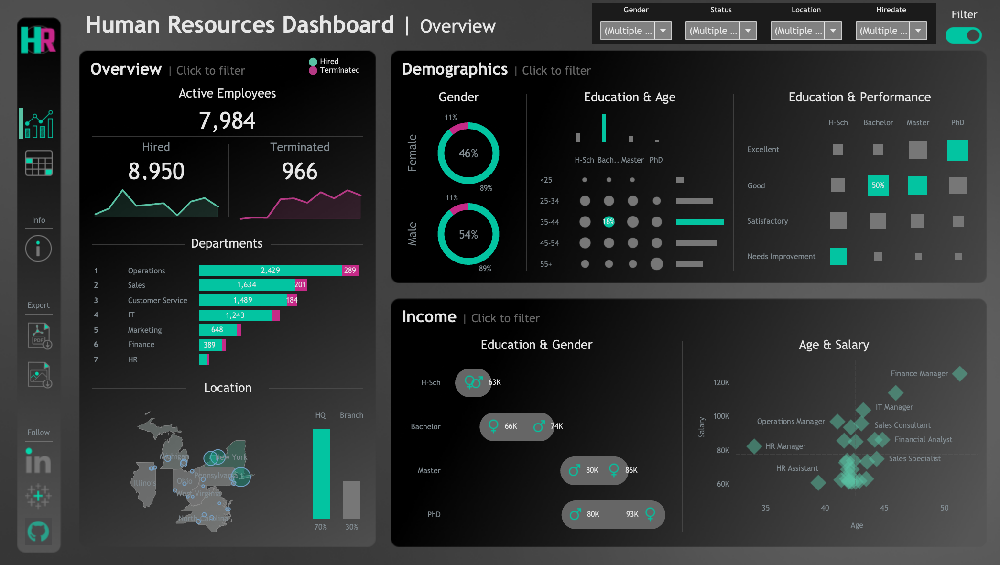
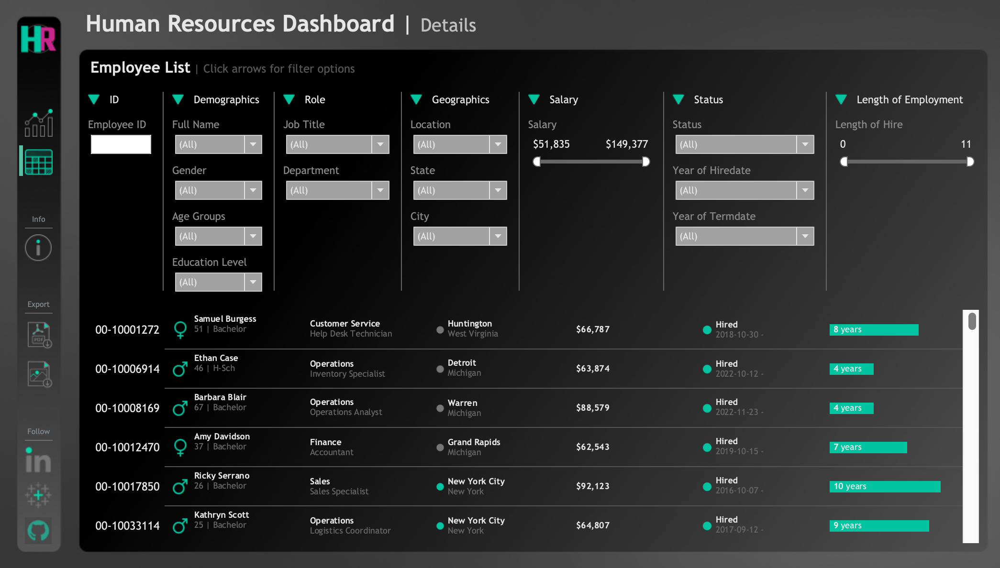

# HR Analytics Dashboard

Interactive HR analytics dashboards built in Tableau to explore workforce trends, employee demographics, hiring and termination patterns, income distribution, and location insights.

## Project Overview

This project includes two dashboards:

- **HR Overview** — a high-level overview of active employees, hires, terminations, departments, demographics, income, and location trends
- **HR Details** — a more detailed dashboard for exploring employee-level and departmental insights

## Tools Used

- Tableau
- Tableau Public
- GitHub

## Key Features

- Interactive dashboard filtering
- Summary and detail dashboard navigation
- Demographic breakdowns by gender, age group, education, and performance
- Salary and income analysis
- Department and location analysis

## Dashboard Preview

### HR Overview

### HR Details

## Live Dashboard

👉 [View Interactive Dashboard on Tableau Public](https://public.tableau.com/app/profile/christopher.stephan3886/viz/HR_Dashboard_17762031604090/HRSummary)

## Files

- `HR_Dashboard.twbx` — Tableau packaged workbook
- `images/` — dashboard screenshots

## Notes

This project was built as a portfolio piece to demonstrate dashboard design, data storytelling, interactivity, and Tableau visualization skills.